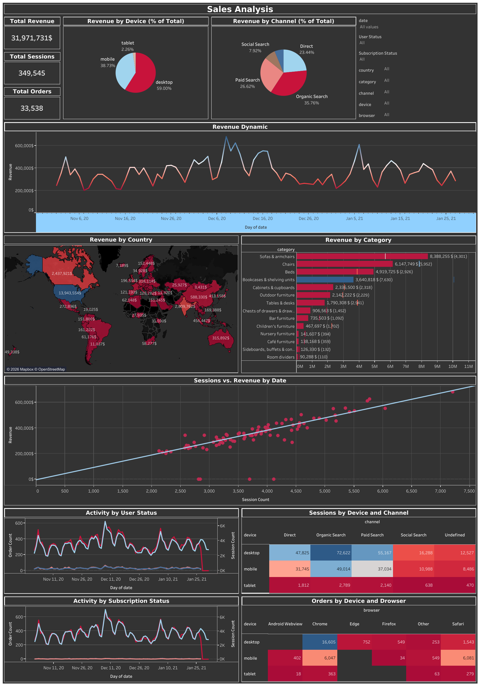

# Sales Analysis Dashboard (Tableau)

## Overview
This project presents an interactive Tableau dashboard for analyzing sales performance and supporting business decision-making.

The goal is to explore key metrics, identify trends, and compare performance across regions.

---

## Tools & Technologies
- Tableau
- Data Visualization
- KPI Analysis

---

## Dataset
The dataset includes sales data used to analyze performance across time, regions, and categories.

---

## Key Features
- Interactive filters  
- KPI tracking (sales performance)  
- Regional analysis  
- Trend analysis over time  

---

## Insights
- Top-performing regions generate the highest revenue  
- Sales show clear trends over time  
- Performance varies across regions and categories   

---

## Key Metrics
- Total Sales  
- Sales by Region  
- Sales Trends over Time

---

## Business Value
Helps businesses monitor performance, identify growth opportunities, and support data-driven decisions.

---

## Dashboard
[View Tableau Dashboard](https://public.tableau.com/app/profile/sofiia.kepeshchuk/viz/book1_17696925029680/SalesAnalysis)

---

## Dashboard Preview

